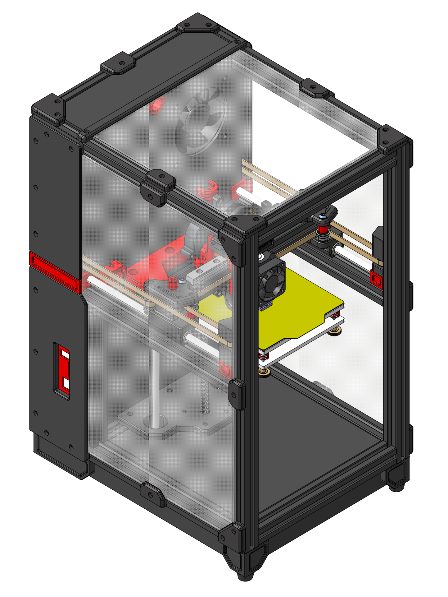

# MINI-Printer
A printer with an workspace of 120 x 120 x 120mm in CoreXY design, based on [WaltMech-M1](https://github.com/WaltMech3d/WaltMech-M1) printer.

## Note
- Compact and portable (250x340x430)
- 120x120x120 workspace
- CoreXY
- Direct Drive Extruder
- Enclosed chamber
- 24V DC heater bed
- Klipper Firmware
