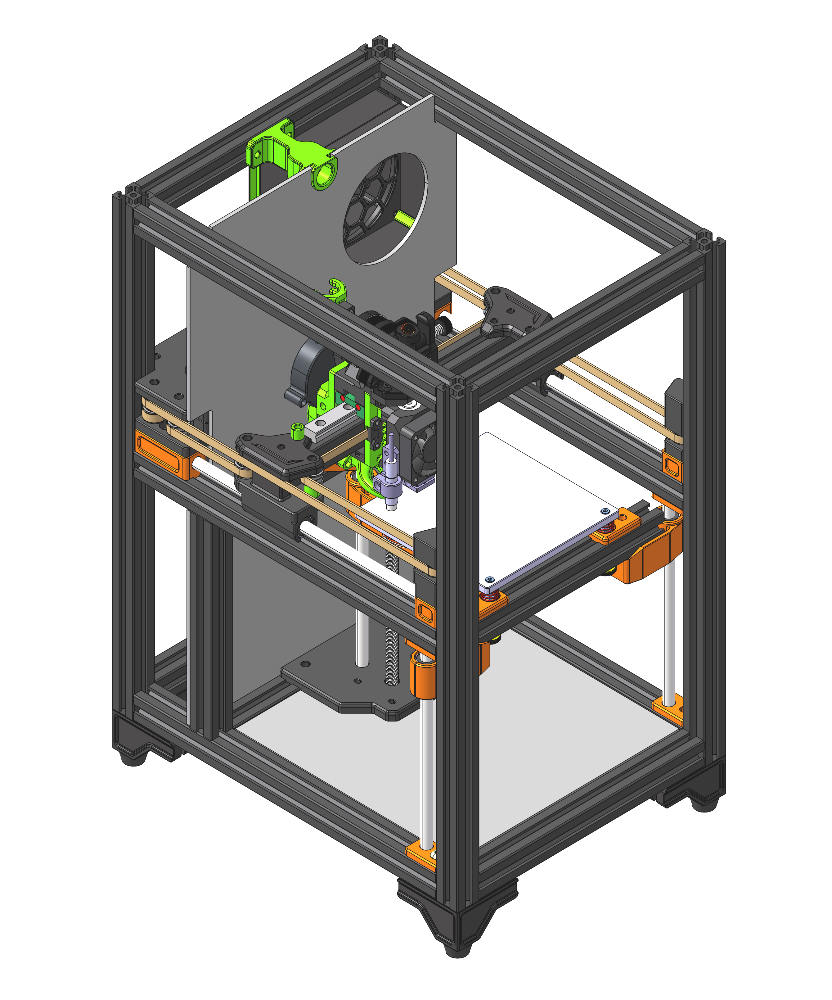

# MINI-Printer
Ein Drucker mit einem Bauraum von 120 x 120 x 120mm in CoreXY bauweise.

## Merkmale
- Kompakt und Transportabel (250x340x430)
- 120x120x120 Bauvolumen
- CoreXY
- Direct Drive Extruder
- Geschlossene Kammer
- 24V DC Heizbett
- Klipper Firmware
